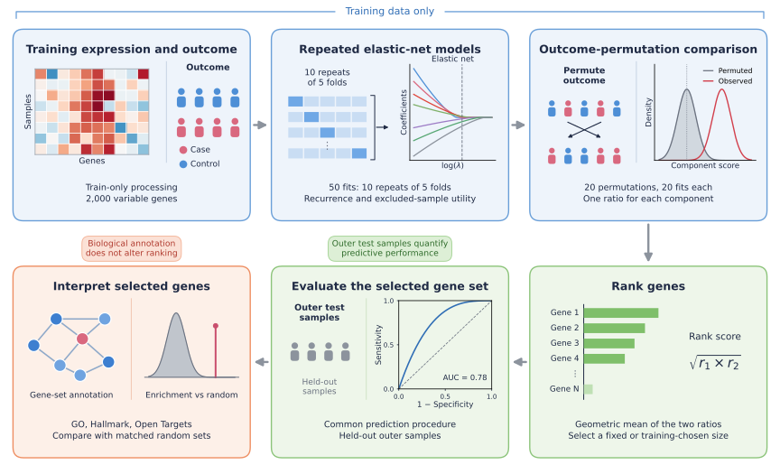

# GeneSelectR 2.0

**Predictive gene selection with inspectable evidence and downstream biological interpretation**

[](LICENSE)
[](https://www.r-project.org/)
[](https://bioconductor.org/)

GeneSelectR 2.0 is an R workflow for predictive gene selection in
binary-outcome transcriptomic studies. Repeated elastic-net models measure how
consistently each gene is selected and how strongly it contributes to
predictions for samples excluded from each fit. Both measurements are compared
with gene-specific outcome-permutation references and combined into a single
ranking. The component measurements remain available for inspection, and the
selected genes can then be characterised with Gene Ontology, Hallmark gene
sets, Open Targets and STRING.

The R package is named `GeneSelectR2`.

<p align="center">
  
</p>

## Key features

- **Selection recurrence.** Fifty elastic-net fits (ten repetitions of
  stratified five-fold division) record how often each gene receives a
  non-zero coefficient.
- **Excluded-sample contribution.** Linear SHAP contributions are calculated
  only for samples left out of each fit and combined with mutual information
  into a predictive utility.
- **Outcome-permutation adjustment.** Twenty shuffled-outcome references, each
  with 20 fits, give a gene-specific reference for both measurements.
- **Transparent ranking.** The final score is the equal-weight geometric mean
  of the two adjusted ratios. Every component is reported in the output.
- **Biological interpretation after ranking.** Gene Ontology, Hallmark,
  Open Targets and STRING functions describe the selected genes and do not
  change the ranking.
- **Bioconductor input.** A `SummarizedExperiment` or a samples-by-genes
  numeric matrix is accepted.

## Installation

Install the development version from the `BioC` branch:

```r
# install.packages("remotes")
remotes::install_github("dzhakparov/GeneSelectR-2.0", ref = "BioC")
```

A local source checkout can be installed with:

```r
install.packages(".", repos = NULL, type = "source")
```

Following Bioconductor acceptance, the release version will be installed with:

```r
BiocManager::install("GeneSelectR2")
```

## Quick start

```r
library(GeneSelectR2)

data(asthma_example)
fit <- select_genes(
    asthma_example, "severity", n_genes = 20,
    alpha = 0.5, B = 5, permutations = 2, null_B = 5
)
fit$selected_genes
head(fit$gene_scores)
```

The example uses packaged data (96 samples and 300 genes from GSE69683) and
reduced computation. It does not reproduce the full benchmark. The standard
workflow uses 50 fits, 20 permutations and 20 fits per permutation, and
compares elastic-net mixing values of 0.5 and 1. One worker is used by
default.

## Output

`select_genes()` returns the complete gene score table, the selected gene
names, the internal alpha comparison, a stability measurement and resampling
diagnostics. The gene score table contains:

| Column | Description |
|---|---|
| `recurrence` | Fraction of internal fits with a non-zero coefficient |
| `shap_frequency` | Fraction of excluded samples in which the gene is a high contributor |
| `mutual_information` | Mean mutual information with the outcome (nats) |
| `predictive_contribution` | Raw predictive utility |
| `adjusted_recurrence` | Recurrence relative to the shuffled-outcome reference |
| `adjusted_contribution` | Utility relative to the shuffled-outcome reference |
| `combined_score`, `final_score` | Geometric mean of the adjusted ratios and its percentile |

The adjusted ratios are ranking quantities. They are not probabilities,
p-values or false-discovery-rate estimates. Internal AUC is a tuning
measurement; independent samples or an outer resampling loop are required to
estimate predictive performance.

## Documentation

The package contains two vignettes:

- *GeneSelectR 2.0 workflow*: supported applications, input
  representations, model outputs, biological assessment and reproducibility
  requirements.
- *Predictive gene selection in asthma*: an evaluated `SummarizedExperiment`
  analysis with an external-validation outline.

```r
browseVignettes("GeneSelectR2")
```

First use of annotation-dependent functions may create files in the
platform-specific R cache directory. `cache_info()` reports their location and
size. Record the resource release, query term, thresholds and retrieval date
for Open Targets and STRING results.

## Scope

GeneSelectR 2.0 supports binary outcomes, such as disease status, treatment
response, infection status and pre-specified pairwise subtype comparisons.
Survival, continuous-outcome and multiclass analyses require separate methods.
Input must already be normalized; select variable genes and fit preprocessing
steps on training samples only.

## Support

Questions and reproducible problem reports can be submitted through the
[issue tracker](https://github.com/dzhakparov/GeneSelectR-2.0/issues).
Include the output of `sessionInfo()`, the function call and the complete
error message.

## Development checks

Source submissions should pass `R CMD build`, `R CMD check` and
`BiocCheck::BiocCheck()` under the current Bioconductor development release.

## License

MIT. See [LICENSE](LICENSE).
